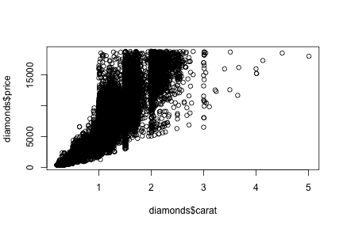

## Overview

1. This project is an exercise in estimating the price of diamond based on
   - carat,
   - cut, 
   - color 
2. Some challenges
3. Linear models 
4. Final solution


--- .class #id 

## Challenges

1. Linear model is not ideal for estimating the price of diamonds. Simple model based only carat will result in a negative price for small diamonds. See figure below

```r
library(ggplot2)
data(diamonds)
plot(diamonds$price ~ diamonds$carat)
```

 
3. Factoring in the cut and color makes the problem more difficult. 

--- .class #id 

## Linear Models

After some fine tuning we came up with using a combination of the following 4 linear models based on the diamonds dataset.

1. Linear fit through the origin based solely on the size
2. linear fit (with intercept) based solely on size
3. linear fit based on size and color
4. linear fit based on size and cut

--- .class #id 

## Final Solution

After some fine tunings, we ended with the following heuristics 

1. For diamond of size less than 1.0 carat, we use the maximum the first two estimates as the price.

2. For diamond 1.0 carat or more, we compute average of the latter two estimates and use it only when it gives a higher estimate than the first.

